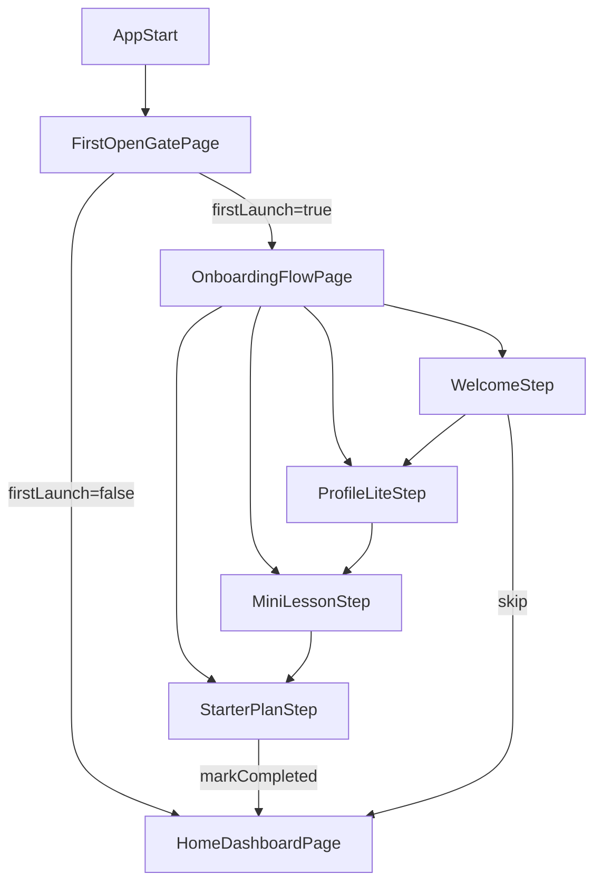

# 首次打开 Onboarding 代码修改方案

## 现状判断
当前 Flutter 应用入口非常轻量，`[testapp/lib/main.dart](testapp/lib/main.dart)` 直接把 `MaterialApp.home` 指向 `HolaWelcomePage`，并通过手写 `Navigator.push(...)` 进入模板页；项目里还没有独立路由、首开标记、问卷模型或 onboarding feature。

关键现状代码：

```15:30:testapp/lib/main.dart
void main() => runApp(const MyApp());

class MyApp extends StatelessWidget {
  const MyApp({super.key});

  @override
  Widget build(BuildContext context) {
    return MaterialApp(
      debugShowCheckedModeBanner: false,
      theme: ThemeData(
        colorScheme: ColorScheme.fromSeed(seedColor: const Color(0xFF1FA95B)),
      ),
      home: const HolaWelcomePage(),
    );
  }
}
```

这意味着本次最稳妥的改法不是一次性引入大型路由/状态管理框架，而是沿用当前项目的轻量模式：`StatefulWidget + setState + shared_preferences`，先把首开教育闭环跑通。

## 推荐实现方向
采用“**一个 onboarding feature + 一个流式容器页 + 若干步骤子组件**”的方案。

原因：
- 与当前项目复杂度匹配，不额外引入 `GoRouter` / `Riverpod` / `Bloc`。
- 文档中的 4 个步骤天然适合做成单一 flow 容器，统一控制进度、按钮文案、跳过与完成逻辑。
- 当前依赖里已经有 `shared_preferences`，可以直接用于“是否完成首开引导”的持久化。

## 拟修改与新增文件
保留现有 `stock_insight` feature 不动，新建与之并列的 onboarding 模块。

优先修改：
- `[testapp/lib/main.dart](testapp/lib/main.dart)`
- `[testapp/pubspec.yaml](testapp/pubspec.yaml)` 仅在需要补充插画/字体/图片资源声明时调整

建议新增：
- `[testapp/lib/features/onboarding/pages/first_open_gate_page.dart](testapp/lib/features/onboarding/pages/first_open_gate_page.dart)`
- `[testapp/lib/features/onboarding/pages/onboarding_flow_page.dart](testapp/lib/features/onboarding/pages/onboarding_flow_page.dart)`
- `[testapp/lib/features/onboarding/pages/home_dashboard_page.dart](testapp/lib/features/onboarding/pages/home_dashboard_page.dart)`
- `[testapp/lib/features/onboarding/widgets/onboarding_welcome_step.dart](testapp/lib/features/onboarding/widgets/onboarding_welcome_step.dart)`
- `[testapp/lib/features/onboarding/widgets/onboarding_profile_step.dart](testapp/lib/features/onboarding/widgets/onboarding_profile_step.dart)`
- `[testapp/lib/features/onboarding/widgets/onboarding_lesson_step.dart](testapp/lib/features/onboarding/widgets/onboarding_lesson_step.dart)`
- `[testapp/lib/features/onboarding/widgets/onboarding_starter_plan_step.dart](testapp/lib/features/onboarding/widgets/onboarding_starter_plan_step.dart)`
- `[testapp/lib/features/onboarding/widgets/task_card.dart](testapp/lib/features/onboarding/widgets/task_card.dart)`
- `[testapp/lib/features/onboarding/data/onboarding_preferences_service.dart](testapp/lib/features/onboarding/data/onboarding_preferences_service.dart)`
- `[testapp/lib/features/onboarding/domain/onboarding_models.dart](testapp/lib/features/onboarding/domain/onboarding_models.dart)`

## 页面与流程设计



### 1. 入口页改造
在 `[testapp/lib/main.dart](testapp/lib/main.dart)` 中，把 `home: const HolaWelcomePage()` 替换为首开判断容器页，例如 `FirstOpenGatePage`。

`FirstOpenGatePage` 负责：
- 启动时异步读取本地首开标记。
- 未完成 onboarding 时进入 `OnboardingFlowPage`。
- 已完成时直接进入 `HomeDashboardPage`。
- 读取期间展示一个极简 loading/splash 态，避免页面闪动。

### 2. Onboarding 流容器
`OnboardingFlowPage` 作为单一流程页，内部用 `PageView` 或 IndexedStack 管控 4 个步骤，不开放手势随意跳步，只允许通过底部 CTA 前进。

建议容器自身管理：
- `currentStepIndex`
- `OnboardingProfileAnswers`
- `MiniLessonProgress`
- `canContinue`
- `isSubmitting`

这里可以复用当前项目已有的 `PageView + 指示器` 交互风格，参考 `[testapp/lib/features/stock_insight/pages/stock_insight_template_page.dart](testapp/lib/features/stock_insight/pages/stock_insight_template_page.dart)` 中的分页实现。

关键参考代码：

```164:225:testapp/lib/features/stock_insight/pages/stock_insight_template_page.dart
SizedBox(
  height: 150,
  child: PageView.builder(
    controller: _infoPageController,
    itemCount: safeCategories.length,
    onPageChanged: (int index) {
      setState(() {
        _currentInfoIndex = index;
      });
    },
    itemBuilder: (BuildContext context, int index) {
      // ...
    },
  ),
),
```

### 3. 四步内容落地
依据文档，把步骤拆成 4 个明确职责的 widget：

- `WelcomeStep`
  - 文案采用“为年轻人攒下第一桶金 / 不荐股、不带杠杆”。
  - 提供主 CTA“进入新手村”和次级动作“稍后再说”。
  - `跳过` 时直接写入“已跳过 onboarding”标记并落入首页。

- `ProfileLiteStep`
  - 3 组单选题：身份、每月可攒金额、面对波动的情绪。
  - 用卡片式单选按钮实现，不用表单输入框。
  - 每选一项，在底部或题目下方展示一条轻反馈文案。

- `MiniLessonStep`
  - 用 3 个小卡片/迷你关卡解释“本金 / 涨跌 / 盈亏”。
  - 建议采用点击切换示例数字的小互动，而不是复杂动画，优先保证第一版可读性与完成度。

- `StarterPlanStep`
  - 根据 `ProfileLiteStep` 的答案生成个性化起步计划，例如“先从每月 200 元开始”“优先建立稳定定投习惯”。
  - 页面底部 CTA 为“进入首页，查看今日新手任务”。

### 4. 首页承接页
新增 `HomeDashboardPage`，先做一个最小可用首页，承接产品文档中的 `Home_01_Dashboard`。

首页第一版建议只包含：
- 顶部欢迎语 + “我的小金库”入口占位。
- “今日新手任务”卡片。
- “继续新手村课程”入口。
- 如用户来自 onboarding，则可带入一句个性化提示文案。

这样能把 UX 文档的闭环补齐，同时不必一次实现完整投资首页。

## 数据与持久化设计
使用当前已声明但尚未使用的 `shared_preferences` 存储最小状态：
- `hasCompletedOnboarding`
- `hasSkippedOnboarding`
- `onboardingProfileSnapshot`（可选，第一版也可先不落盘，只在内存中生成起步计划）

`onboarding_models.dart` 建议包含：
- `enum SavingsRange`
- `enum UserIdentityType`
- `enum VolatilityFeeling`
- `class OnboardingProfileAnswers`
- `class StarterPlanViewModel`

`onboarding_preferences_service.dart` 建议封装：
- `Future<bool> shouldShowOnboarding()`
- `Future<void> markOnboardingCompleted()`
- `Future<void> markOnboardingSkipped()`
- `Future<void> saveProfileAnswers(...)`（可选）

## UI 风格建议
根据产品文档，视觉方向应是“游戏新手村 + 可爱但理性”。实现上建议：
- 继续沿用现有浅底绿色系种子色，但扩展一组更年轻的辅色，如奶油黄、浅橙、淡蓝。
- 全局使用大圆角卡片、轻阴影、柔和渐变背景。
- 关键信任点文案固定出现：`不荐股`、`不带杠杆`、`只教你看懂规则`。
- 动效只放在高价值位置：步骤切换、卡片选中、进度条推进，不做重型动画。

## 实施顺序
1. 改造 `[testapp/lib/main.dart](testapp/lib/main.dart)`，引入 `FirstOpenGatePage` 作为统一入口。
2. 新增 `onboarding` feature 的 `domain/data/pages/widgets` 基础骨架。
3. 先完成 `WelcomeStep + ProfileLiteStep + Flow 容器`，打通可前进的半流程。
4. 再补 `MiniLessonStep + StarterPlanStep`，完成文档定义的 4 步闭环。
5. 新增 `HomeDashboardPage`，承接 onboarding 完成或跳过后的落点。
6. 增加基础 widget test，至少验证首开分流、问卷 CTA 可用性、完成后跳首页三个关键路径。

## 验收标准
- 首次启动时进入 onboarding，而不是旧的 `HolaWelcomePage`。
- 点击“稍后再说”可以直接进入首页，且二次启动不再重复进入 onboarding。
- 完成 3 组问题后，才能从 `ProfileLiteStep` 进入下一步。
- `StarterPlanStep` 能根据用户选择展示差异化建议。
- 完成 onboarding 后再次启动直接进入 `HomeDashboardPage`。

## 风险与后续扩展
当前项目没有正式路由体系，因此本方案故意不引入新框架；如果后续页面继续增长，再统一迁移到 `GoRouter` 会更合适。

如果希望后续继续扩展，可以在第二阶段补：
- Firebase Analytics 埋点
- `MiniLesson` 的更强互动动画
- 真正的首页资产卡与新手任务系统
- 画像落盘与个性化推荐逻辑